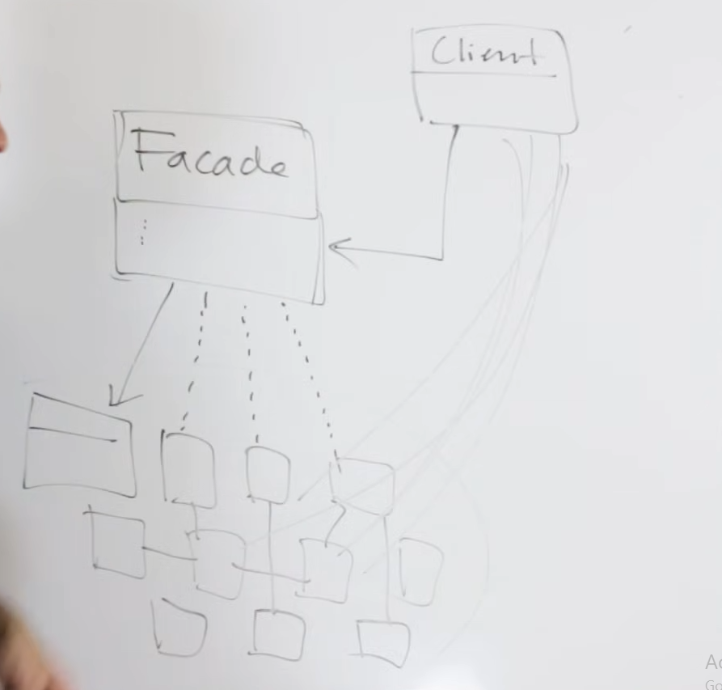

# Il Pattern Facade 

Il patttern facade viene utilizzato principalmente nel momento in cui,
per l inizializzazione di un servizio, dobbiamo inizializzare diversi sottoservizi, magari 
a causa di diversi pattern utilizzati, questo non è un male, ma il facade serve quindi ad offrire un 
inizializzazione rapida

## il facade è un pattern utilizato in sistemi complessi 
offrendo così un "interfaccia"

in questa foto il client utilizza la classe facade per avere un interfaccia 
su tutte le varie classi, bisogna ricordare che queste classi sono parte di un
"gruppo" che può derivare dal single responsability principle

fornisce un interfaccia ad un sub-set di interfacce